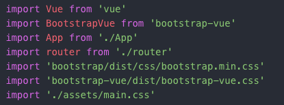

kf18302 Sherry Chiang

da18787 Ya-Ting Lin

Marks for each section
---
#### HTML:
- B

#### CSS:
- B: with bootstrap, still trying to beautify the page

#### JS:
- B: with vue

#### PNG:
- C: png images are all downloaded at the moment

#### SVG:
- D: svg images are all downloaded at the moment

#### Server:
- X

#### Database:
- D: trying to use web crawler with python but still learning

#### Dynamic Pages:
- X

Prelim Report
---
We installed `vue official cli` and `bootstrap.vue` and followed the instructions below from the internet.
```
# Ensure Vue CLI is installed and up to date
npm i -g vue-cli

# Initialize a BootstrapVue project in the directory 'my-project'
vue init bootstrap-vue/webpack my-project-name

# Change into the directory
cd my-project-name

# Install dependencies
npm i

# Fire up the dev server with HMR
npm run dev
```

When we were installing `bootstrap`, we had some errors. For example, the system required us to install `jquery@1.9.1` so we googled and solve this problem from stackoverflow.
- Error:


- Solution- nom I jquery@1.9.1 —save:


After installing `vue cli`, we compile with `npm run dev` to try to open local host, but it failed to open. That was because there was syntax error in the `main.js` file. Looking at the second line, we had to fix the quotation marks to single quotation marks.
- Before revise:

- After revise:


Beacause we installed `vue cli`, the folder structure was build in advance so we followed its own folder structure. We put our images into `src->assets`. And the files of every page were put into `src->component`. The file of every page is a component in `vue.js`. The component system is an important concept in Vue. We wrote `html`, `css` and `javascript` in the same file because it is the special feature in vue.

When styling with `css`, we set every `div` with a backgroud colour so it's more clear to rearrange each `div`. The images are all downloaded from either premier league website or club websites at the moment.

- Should we draw our own images like club crests and premier league logo?

Introduction of every page
---
- In our home page `index.vue`, we decided to put latest news and latest Premier League Table. We have not totally understand how to use python (web crawler) to get information and store the data into database. So at the moment we just put the news we got from “Football Statistic” [Football Statistics | Football Live Scores | WhoScored.com](https://www.whoscored.com/).

- Still have not finish yet:
  + In our Player page, we will put the player’s information and analysation. We use `bootstrap.vue`’s component called card and add some html and js in this layout.

  + For the Club pages, the news is also from web crawler which we have not figure out yet.
